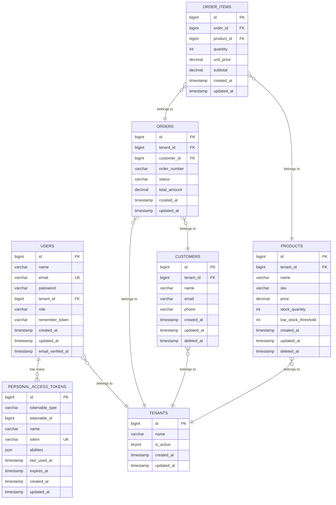

## Database Schema & ERD Diagram

### Database Schema

This schema defines the core tables for the multi-tenant POS/Inventory system, ensuring data isolation and supporting the required business logic.

#### 1. Tenants Table (`tenants`)

Stores information about each business tenant.

| Column Name | Data Type      | Constraints         | Description                             |
| :---------- | :------------- | :------------------ | :-------------------------------------- |
| `id`        | BIGINT UNSIGNED| PRIMARY KEY, AUTO_INCREMENT | Unique identifier for the tenant. |
| `name`      | VARCHAR(255)   | NOT NULL            | Name of the tenant/business.          |
| `is_active` | TINYINT(1)     | NOT NULL, DEFAULT 1 | Flag indicating if the tenant is active (1) or not (0). |
| `created_at`| TIMESTAMP      |                     | Timestamp when the tenant was created.  |
| `updated_at`| TIMESTAMP      |                     | Timestamp when the tenant was last updated. |

#### 2. Users Table (`users`)

Stores user accounts, each associated with a single tenant and a role.

| Column Name | Data Type      | Constraints         | Description                             |
| :---------- | :------------- | :------------------ | :-------------------------------------- |
| `id`        | BIGINT UNSIGNED| PRIMARY KEY, AUTO_INCREMENT | Unique identifier for the user. |
| `name`      | VARCHAR(255)   | NOT NULL            | Full name of the user.                  |
| `email`     | VARCHAR(255)   | NOT NULL, UNIQUE    | Unique email address for the user.      |
| `password`  | VARCHAR(255)   | NOT NULL            | Hashed password.                        |
| `tenant_id` | BIGINT UNSIGNED| NOT NULL, FOREIGN KEY (tenants.id) | Links the user to their tenant. |
| `role`      | VARCHAR(50)    | NOT NULL            | User's role (e.g., 'Owner', 'Staff').   |
| `remember_token` | VARCHAR(100) | NULL              | Token for "Remember Me" functionality (Sanctum). |
| `created_at`| TIMESTAMP      |                     | Timestamp when the user was created.    |
| `updated_at`| TIMESTAMP      |                     | Timestamp when the user was last updated. |
| `email_verified_at` | TIMESTAMP | NULL            | Timestamp when the email was verified.  |

#### 3. Personal Access Tokens Table (`personal_access_tokens`)

Standard Laravel Sanctum table for API tokens.

| Column Name | Data Type      | Constraints         | Description                             |
| :---------- | :------------- | :------------------ | :-------------------------------------- |
| `id`        | BIGINT UNSIGNED| PRIMARY KEY, AUTO_INCREMENT | Unique identifier for the token. |
| `tokenable_type` | VARCHAR(255) | NOT NULL        | Type of the model associated with the token (e.g., 'App\Models\User'). |
| `tokenable_id` | BIGINT UNSIGNED | NOT NULL       | ID of the model instance associated with the token. |
| `name`      | VARCHAR(255)   | NOT NULL            | Name given to the token.                |
| `token`     | VARCHAR(64)    | NOT NULL, UNIQUE    | The hashed token value.                 |
| `abilities` | JSON           | NULL                | JSON array of abilities granted to the token. |
| `last_used_at` | TIMESTAMP   | NULL                | Timestamp when the token was last used. |
| `expires_at` | TIMESTAMP     | NULL                | Timestamp when the token expires.       |
| `created_at`| TIMESTAMP      |                     | Timestamp when the token was created.   |
| `updated_at`| TIMESTAMP      |                     | Timestamp when the token was last updated. |

#### 4. Products Table (`products`)

Stores product information, scoped to a specific tenant.

| Column Name      | Data Type      | Constraints         | Description                             |
| :--------------- | :------------- | :------------------ | :-------------------------------------- |
| `id`             | BIGINT UNSIGNED| PRIMARY KEY, AUTO_INCREMENT | Unique identifier for the product. |
| `tenant_id`      | BIGINT UNSIGNED| NOT NULL, FOREIGN KEY (tenants.id) | Links the product to its tenant. |
| `name`           | VARCHAR(255)   | NOT NULL            | Name of the product.                    |
| `sku`            | VARCHAR(255)   | NOT NULL            | Stock Keeping Unit, unique per tenant.  |
| `price`          | DECIMAL(10, 2) | NOT NULL            | Price of the product.                   |
| `stock_quantity` | INT            | NOT NULL, DEFAULT 0 | Current quantity of the product in stock. |
| `low_stock_threshold` | INT       | NOT NULL, DEFAULT 0 | Threshold below which the product is considered low stock. |
| `created_at`     | TIMESTAMP      |                     | Timestamp when the product was created. |
| `updated_at`     | TIMESTAMP      |                     | Timestamp when the product was last updated. |
| `deleted_at`     | TIMESTAMP      | NULL                | Timestamp for soft deletion.            |
| **Index**        |                | `UNIQUE(tenant_id, sku)` | Ensures SKU uniqueness within a tenant. |

#### 5. Customers Table (`customers`)

Stores customer information, scoped to a specific tenant.

| Column Name | Data Type      | Constraints         | Description                             |
| :---------- | :------------- | :------------------ | :-------------------------------------- |
| `id`        | BIGINT UNSIGNED| PRIMARY KEY, AUTO_INCREMENT | Unique identifier for the customer. |
| `tenant_id` | BIGINT UNSIGNED| NOT NULL, FOREIGN KEY (tenants.id) | Links the customer to their tenant. |
| `name`      | VARCHAR(255)   | NOT NULL            | Full name of the customer.              |
| `email`     | VARCHAR(255)   | NULL                | Email address of the customer.          |
| `phone`     | VARCHAR(20)    | NULL                | Phone number of the customer.           |
| `created_at`| TIMESTAMP      |                     | Timestamp when the customer was created. |
| `updated_at`| TIMESTAMP      |                     | Timestamp when the customer was last updated. |
| `deleted_at`| TIMESTAMP      | NULL                | Timestamp for soft deletion.            |

#### 6. Orders Table (`orders`)

Stores order information, linked to a customer and scoped to a tenant.

| Column Name | Data Type      | Constraints         | Description                             |
| :---------- | :------------- | :------------------ | :-------------------------------------- |
| `id`        | BIGINT UNSIGNED| PRIMARY KEY, AUTO_INCREMENT | Unique identifier for the order. |
| `tenant_id` | BIGINT UNSIGNED| NOT NULL, FOREIGN KEY (tenants.id) | Links the order to its tenant. |
| `customer_id` | BIGINT UNSIGNED| NULL, FOREIGN KEY (customers.id) | Links the order to a customer (nullable). |
| `order_number` | VARCHAR(255) | NOT NULL            | Unique order number per tenant.         |
| `status`    | VARCHAR(50)    | NOT NULL            | Status of the order (e.g., 'Pending', 'Paid', 'Cancelled'). |
| `total_amount` | DECIMAL(10, 2) | NOT NULL          | Total amount for the order.             |
| `created_at`| TIMESTAMP      |                     | Timestamp when the order was created.   |
| `updated_at`| TIMESTAMP      |                     | Timestamp when the order was last updated. |
| **Index**   |                | `UNIQUE(tenant_id, order_number)` | Ensures order number uniqueness within a tenant. |
| **Index**   |                | `INDEX(tenant_id, status, created_at)` | Optimizes queries for reports filtering by tenant, status, and date. |

#### 7. Order Items Table (`order_items`)

Stores the items within an order, linking orders to products and capturing price at time of order.

| Column Name | Data Type      | Constraints         | Description                             |
| :---------- | :------------- | :------------------ | :-------------------------------------- |
| `id`        | BIGINT UNSIGNED| PRIMARY KEY, AUTO_INCREMENT | Unique identifier for the order item. |
| `order_id`  | BIGINT UNSIGNED| NOT NULL, FOREIGN KEY (orders.id) ON DELETE CASCADE | Links the item to its order. |
| `product_id`| BIGINT UNSIGNED| NOT NULL, FOREIGN KEY (products.id) | Links the item to the product. |
| `quantity`  | INT            | NOT NULL            | Quantity of the product ordered.        |
| `unit_price`| DECIMAL(10, 2) | NOT NULL            | Price of the product at the time of the order. |
| `subtotal`  | DECIMAL(10, 2) | NOT NULL            | Calculated subtotal (quantity * unit_price). |
| `created_at`| TIMESTAMP      |                     | Timestamp when the item was created.    |
| `updated_at`| TIMESTAMP      |                     | Timestamp when the item was last updated. |
| **Index**   |                | `INDEX(tenant_id, order_id)` | Optimizes queries joining orders and order_items for a specific tenant. |

### ERD Diagram (Mermaid)

